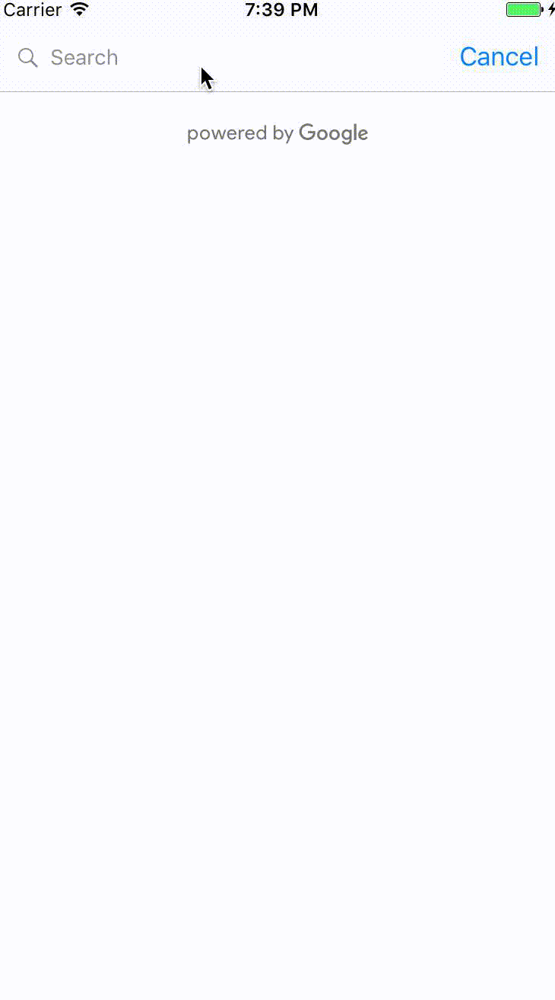

# GooglePlacesSelector
Swift Google Places ViewController using Google Web API
After selecting a row, an event is posted called "place_selected", with object 'selected_place' containing the following parameters as Strings:<br>

city<br>
street<br>
street_number<br>
state<br>
postal_code<br>

or access class struct: place_selected



[](https://travis-ci.org/Mifsud, Spiro/GooglePlacesSelector)
[](http://cocoapods.org/pods/GooglePlacesSelector)
[](http://cocoapods.org/pods/GooglePlacesSelector)
[](http://cocoapods.org/pods/GooglePlacesSelector)

## Example

To run the example project, clone the repo, and run `pod install` from the Example directory first.

## Requirements

## Installation

GooglePlacesSelector is available through [CocoaPods](http://cocoapods.org). To install
it, simply add the following line to your Podfile:

```ruby
pod "GooglePlacesSelector"
```

## Author

Mifsud, Spiro, spiro@materialcause.com

## License

GooglePlacesSelector is available under the MIT license. See the LICENSE file for more info.
